# reeshasx

<p align="center">

</p>

```text
--[ 0x01. About Me ]------------------------------------------------------------
> Security Researcher, Purple teamer.
> Main focus on Web & Infrastructure Penetration Testing and Bug Bounty.
> Minimalist is the key.

--[ 0x02. Arsenal & Tech Stack ]------------------------------------------------
* Languages:   Python, Go and Zig(maybe rust)
* Toolsets:    Burp Suite, Netexec / BloodHound, Sliver 
* OS/Env:      Arch Linux (btw), Tmux, Neovim, Clean lightweight setup (~300MB RAM)

--[ 0x03. Publications & Writeups ]--------------------------------------------
* Technical articles and security writeups published at:
  -> https://pwnd.blog

--[ 0x04. PGP Public Key ]------------------------------------------------------
* Key ID:      0x350C3E74BAD33C98
* Fingerprint: 0D0C 67BB 25B3 D4E3 D743 C1E1 350C 3E74 BAD3 3C98
* Import cmd:  curl -s https://pwnd.blog/pubkey.asc| gpg --import
```

---
<p align="right">
  <font size="2" color="#4b5563">patience &gt; fancy tools // EOF</font>
</p>
